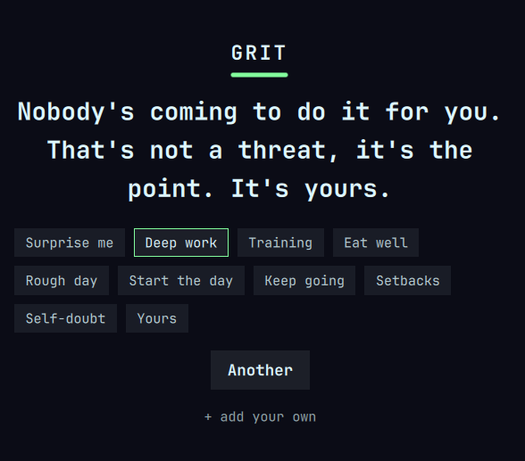

# Grit

A no-nonsense motivation plugin for Omarchy. Click it when you need a push, and it gives you one straight, honest line. No cheese, no fortune-cookie nonsense.

Grit lives in your bar. Press it and a small card appears with a line from whichever category you're in. The voice is firm and real, someone in your corner who actually wants you to move, not an inspirational poster.



## The point of Grit: make it yours

This is the bit that matters, so it's first.

Grit ships with a solid starter set (144 lines across 8 categories), but that's a **seed, not the product**. The real power is filling it with the lines that hit *you*: your own, the ones from people you rate, the one your old coach used to say that still gets you off the sofa. A motivation line lands hardest when it's yours.

So the intended way to use Grit is to add your own until the built-ins are the minority. Two ways to do that, below.

### Add one at a time

Open the panel, hit **+ add your own**, type your line, press Enter. Done. It's saved instantly and shows up under the **Yours** category.

### Add a whole stack at once

Your lines live in a plain file:

```
~/.local/state/omarchy/grit-custom.json
```

It's a JSON array of strings. Open it in any editor (create it if it isn't there yet) and paste in as many as you like:

```json
[
  "Get up. You've done harder than this.",
  "The work is the only thing that never lies to you.",
  "Discipline is remembering what you want when you want to quit.",
  "You are capable. That's not flattery, it's why there's no excuse left."
]
```

Save it. Grit watches the file and reloads live, no restart needed. Your lines appear under **Yours** straight away, and in the **Surprise me** shuffle.

That file lives in your state directory, **not** the plugin folder, so a plugin update will never touch your lines.

### Keeping and sharing your lines

Because it's just a JSON file, you can:

- **Back it up / version it** by symlinking or copying `grit-custom.json` into your dotfiles repo. Your motivation library then follows you to every machine.
- **Share lines with everyone** by opening a pull request against `data/lines.json` in this repo (see Contributing). Personal lines stay personal; only PR the ones you'd want strangers reading.

## Features

- One-click boost from your bar
- 8 categories, plus a **Surprise me** shuffle across all of them
- **Add your own**, one at a time or in bulk, kept private and local
- Theme-aware, so it matches your Omarchy colours
- Never nags. It speaks when you ask it to

## Install

```bash
omarchy plugin add https://github.com/brooklynkray/grit --enable
```

Then add the Grit widget to your bar.

## Usage

Click the Grit button in the bar for a line. Click **Another** for the next one. Switch category from the chips in the panel. **Surprise me** pulls from every category, including your own lines.

## Categories

| Category | For |
|----------|-----|
| Deep work | Starting, focusing, finishing the thing |
| Training | Showing up to train even when you don't fancy it |
| Eat well | A healthy, honest relationship with food, no crash-diet nonsense |
| Rough day | A firm but steady push when you're running on empty |
| Start the day | Getting up and out with intent |
| Keep going | Consistency, showing up on the boring days |
| Setbacks | Getting back up after it went wrong |
| Self-doubt | When the voice says you can't |
| Yours | Your own lines (appears once you've added some) |

## A note on the "Eat well" category

It's deliberately about nourishment and balance, not restriction or punishment. Motivation around food tips into unhealthy territory very easily, so Grit keeps it kind. Please keep that spirit if you add your own lines to it.

## Privacy

Grit does not connect to the internet, collect anything, or phone home. Everything, including your custom lines, stays on your machine.

## Contributing

Issues and pull requests welcome. If you're adding built-in lines to `data/lines.json`, keep the voice: firm, honest, direct, no cheese. A line should make someone think "yeah, fair one", never make them wince.

## Licence

MIT. See [LICENSE](LICENSE).
